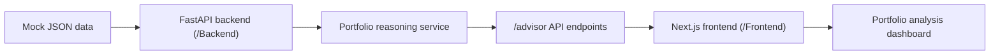

# Financial Advisor Dashboard

A clean assignment-ready financial advisor chat and dashboard app that explains portfolio movement using local mock financial data.

The dashboard links:

**News -> Sector -> Stock -> Portfolio**

It computes market sentiment, sector trends, daily portfolio PnL, concentration risk, mutual-fund look-through exposure, causal explanations, confidence scores, reasoning-quality self-evaluation, and grounded chat answers over the provided fixtures.

## Architecture



## Project Structure

```text
.
├── Backend
│   ├── app
│   │   ├── main.py
│   │   ├── service.py
│   │   ├── intelligence.py
│   │   └── cli.py
│   ├── data
│   │   ├── market_data.json
│   │   ├── historical_data.json
│   │   ├── news_data.json
│   │   ├── portfolios.json
│   │   ├── mutual_funds.json
│   │   └── sector_mapping.json
│   ├── tests
│   └── requirements.txt
├── Frontend
│   ├── app
│   ├── components
│   ├── lib
│   └── package.json
└── README.md
```

## Minimal Setup Required

No external API keys are required. The project runs fully from local mock JSON files in `Backend/data`.

Required:

- Python 3.12+
- Node.js 20+

Optional:

- `NEXT_PUBLIC_API_BASE_URL` if the backend is not running at `http://127.0.0.1:8000`
- `BACKEND_ORIGIN` only when you want the Next.js app to proxy `/advisor/*` requests to a custom backend host

## Run Backend

```bash
cd Backend
python -m venv .venv
source .venv/bin/activate
pip install -r requirements.txt
uvicorn app.main:app --host 127.0.0.1 --port 8000
```

Backend endpoints:

```text
GET  /health
GET  /advisor/portfolios
POST /advisor/analyze/{portfolio_id}
GET  /advisor/market-brief
POST /advisor/chat
```

Example API call:

```bash
curl -X POST http://127.0.0.1:8000/advisor/analyze/PORTFOLIO_002
```

Chat API example:

```bash
curl -X POST http://127.0.0.1:8000/advisor/chat \
  -H "Content-Type: application/json" \
  -d '{"message":"Why did Portfolio 2 fall today?","portfolio_id":"PORTFOLIO_002"}'
```

CLI option:

```bash
cd Backend
python -m app.cli PORTFOLIO_002
```

CLI chat option:

```bash
cd Backend
python -m app.cli PORTFOLIO_002 --ask "What is the concentration risk in this portfolio?"
```

## Run Frontend

Open a second terminal:

```bash
cd Frontend
npm install
npm run dev
```

Then open:

```text
http://127.0.0.1:3000
```

If your backend runs somewhere else:

```bash
NEXT_PUBLIC_API_BASE_URL=http://127.0.0.1:8000 npm run dev
```

If you prefer same-origin proxying through Next.js during local development:

```bash
BACKEND_ORIGIN=127.0.0.1:8000 npm run dev
```

## Deploy on Render

This repo includes a root-level [render.yaml](/Users/abheydua2025/Desktop/stealth%20/render.yaml) Blueprint that creates:

- `stealth-advisor-backend` as a Python web service
- `stealth-advisor-frontend` as a Node/Next.js web service

Recommended steps:

1. Push this repo to GitHub.
2. In Render, choose `New` -> `Blueprint`.
3. Connect the GitHub repo `abhey8/Stealth_by_YC`.
4. Select the branch you pushed.
5. Render will detect `render.yaml` and provision both services.

The frontend uses a Next.js rewrite and the `BACKEND_ORIGIN` service reference from the Blueprint, so browser API calls can stay same-origin instead of hardcoding a public backend URL.

## Demo Flow

1. Start the backend.
2. Start the frontend.
3. Open `http://127.0.0.1:3000`.
4. Select `PORTFOLIO_002`.
5. Click **Run Analysis**.
6. Ask a question in the advisor chat panel, such as “Why did this portfolio move?” or “What is the concentration risk?”
7. Review market summary, sector exposure, stock impact, causal explanation, confidence score, and evaluation notes.

This is designed to fit a 2-3 minute reviewer demo.

## Example Output

For `PORTFOLIO_002`, the portfolio analysis detects the banking-heavy exposure and produces a causal explanation similar to:

```text
Your portfolio fell 2.690% primarily because RBI Holds Repo Rate Steady at 6.5%,
Signals Hawkish Stance Amid Inflation Concerns affected BANKING, where the sector
moved -2.45%. The key affected holdings were AXISBANK, BAJFINANCE, HDFCBANK,
HDFCLIFE, representing 91.37% portfolio exposure.
Confidence score: 95/100 (high).
```

The response also includes:

```json
{
  "portfolioId": "PORTFOLIO_002",
  "confidence_score": 95,
  "confidence_label": "high",
  "reasoning_quality_score": 90,
  "risk_flags": [
    {
      "type": "sector_concentration",
      "sector": "BANKING",
      "exposurePct": 75.181
    }
  ]
}
```

For chat, the response shape includes a grounded natural-language answer plus structured bullets:

```json
{
  "intent": "causal_explanation",
  "portfolioId": "PORTFOLIO_002",
  "answer": "Your portfolio fell 2.690% primarily because ...",
  "bullets": [
    "Macro: RBI Holds Repo Rate Steady at 6.5%, Signals Hawkish Stance Amid Inflation Concerns",
    "Sectors: BANKING, FINANCIAL_SERVICES, REALTY",
    "Stocks: AXISBANK, BAJFINANCE, HDFCBANK, HDFCLIFE"
  ]
}
```

## Reasoning Approach

The backend uses deterministic, rule-based reasoning over the provided JSON files:

- Market sentiment is aggregated from index movement.
- Sector trends combine sector performance, stock movement, and historical momentum.
- News is classified as market, sector, or stock level.
- High-impact news is mapped to sectors using explicit `causal_factors`, entity tags, and sector mapping.
- Sectors are mapped to affected stocks.
- Affected stocks are intersected with portfolio holdings.
- Portfolio impact is computed from daily PnL contribution and portfolio exposure.
- Confidence is downgraded when evidence is incomplete or signals conflict.
- Reasoning quality is scored from causal completeness, link correctness, clarity, and confidence alignment.
- Chat answers are routed to the same market, analytics, and causal outputs, so the chat agent stays deterministic and grounded in the assignment data.

## Verification

Backend:

```bash
cd Backend
source .venv/bin/activate
PYTHONPATH=. pytest -q
```

Frontend:

```bash
cd Frontend
npm run typecheck
npm run test
npm run build
```

## Limitations

- Uses mock data only; it does not call live market/news APIs.
- Reasoning is transparent and deterministic, not LLM-generated.
- Confidence scores are bucketed for explainability, not statistical probabilities.
- The app is optimized for assignment review, not production authentication or multi-user persistence.
